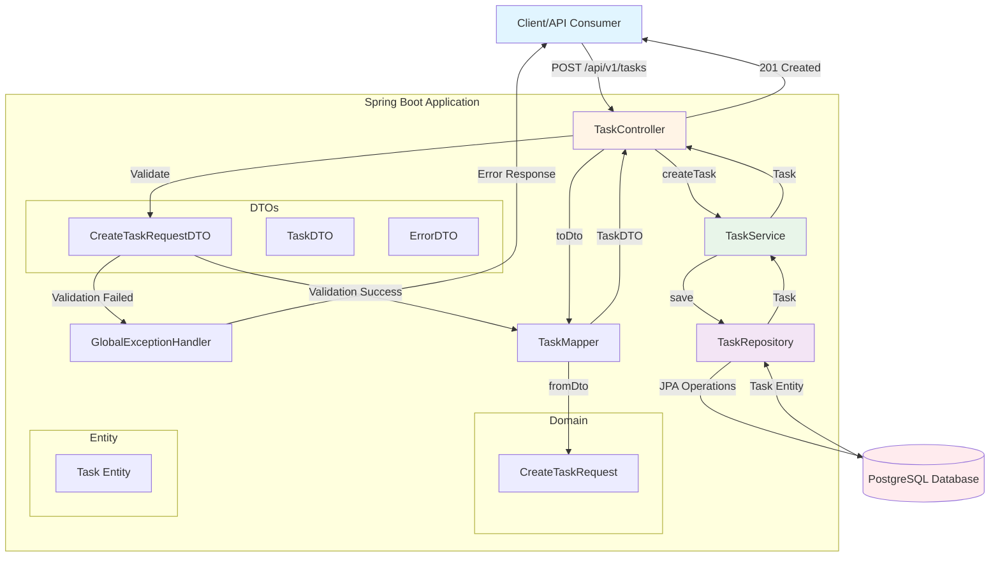
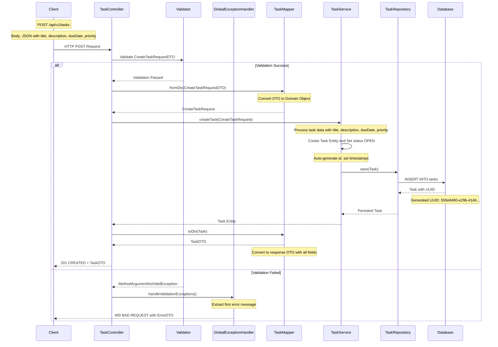
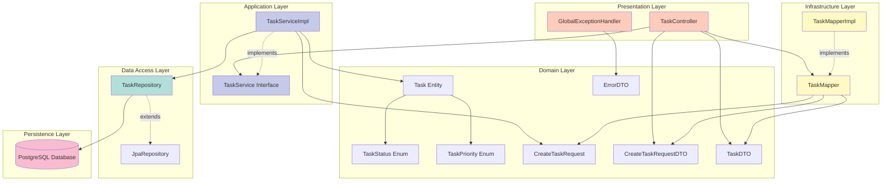
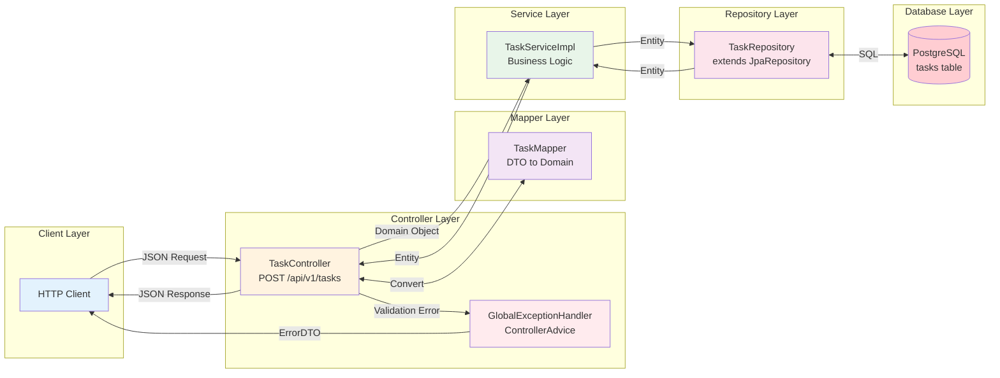
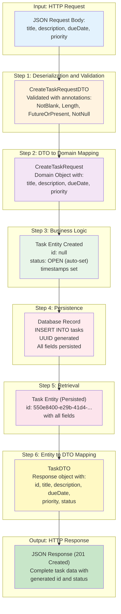
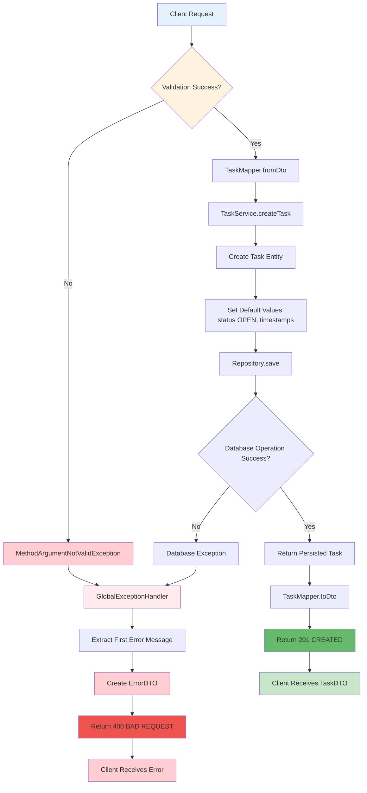
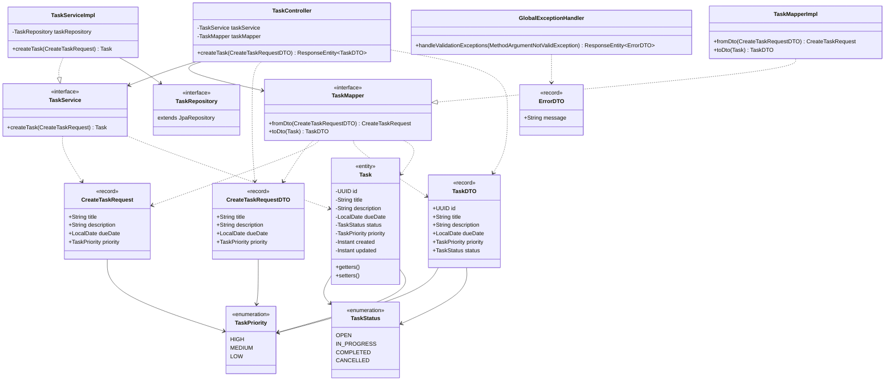
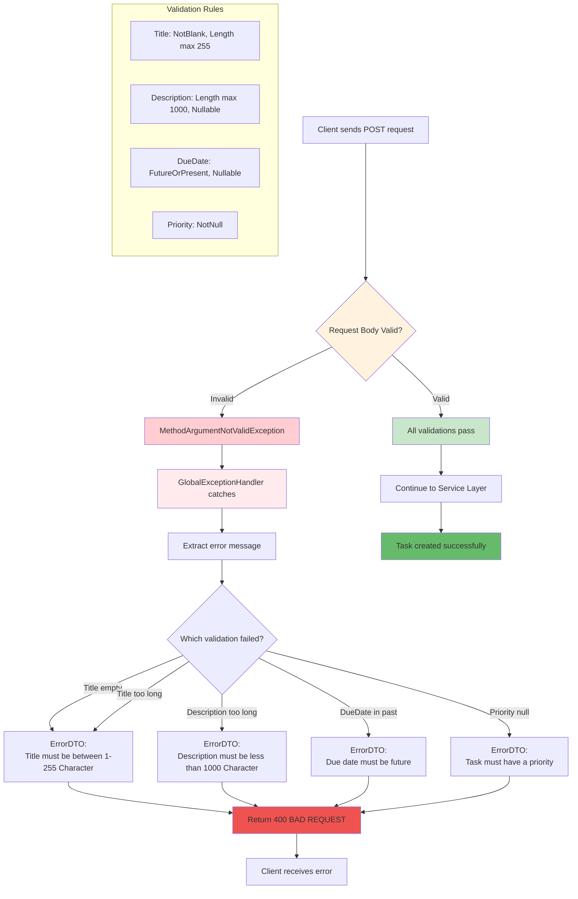
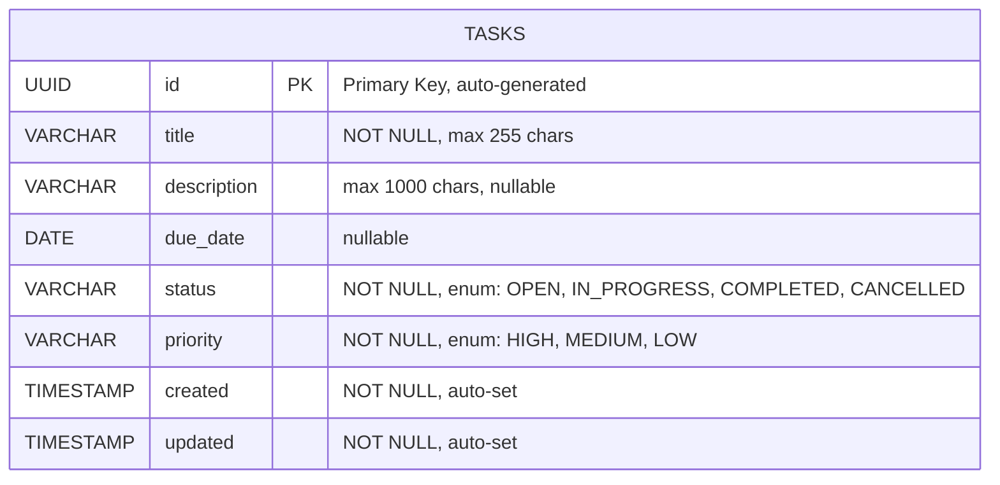

# Task Manager Application - Complete Architecture Flow Diagram

This document provides a comprehensive overview of the Task Manager application's architecture and data flow using Mermaid diagrams.

## 1. Complete Application Flow Overview



## 2. Detailed Request-Response Flow with Examples



## 3. Layer Architecture Diagram



## 4. Component Interaction Diagram



## 5. Data Transformation Flow



## 6. Error Handling Flow



## 7. Class Diagram with Relationships



## 8. Validation Flow Example



## 9. Database Entity Mapping



## 10. Complete End-to-End Example

### Example Request:
```http
POST http://localhost:8080/api/v1/tasks
Content-Type: application/json

{
  "title": "Complete Spring Boot Tutorial",
  "description": "Learn Spring Boot basics including REST APIs, JPA, and validation",
  "dueDate": "2026-02-15",
  "priority": "HIGH"
}
```

### Processing Steps:

1. **Controller Layer** (TaskController)
   - Receives HTTP POST request
   - Spring deserializes JSON to CreateTaskRequestDTO
   - Validation annotations are checked

2. **Validation Layer**
   - `@NotBlank` - title is not blank ✓
   - `@Length(max=255)` - title length is 28 ✓
   - `@Length(max=1000)` - description length is 70 ✓
   - `@FutureOrPresent` - dueDate is 2026-02-15 (future) ✓
   - `@NotNull` - priority is HIGH ✓

3. **Mapping Layer** (TaskMapper)
   - Converts CreateTaskRequestDTO → CreateTaskRequest
   ```
   CreateTaskRequest(
     title = "Complete Spring Boot Tutorial",
     description = "Learn Spring Boot basics including REST APIs, JPA, and validation",
     dueDate = 2026-02-15,
     priority = HIGH
   )
   ```

4. **Service Layer** (TaskServiceImpl)
   - Creates Task entity with additional fields:
   ```
   Task(
     id = null,  // will be auto-generated
     title = "Complete Spring Boot Tutorial",
     description = "Learn Spring Boot basics including REST APIs, JPA, and validation",
     dueDate = 2026-02-15,
     status = OPEN,  // auto-set by service
     priority = HIGH,
     created = 2026-01-21T10:30:00Z,  // current timestamp
     updated = 2026-01-21T10:30:00Z   // current timestamp
   )
   ```

5. **Repository Layer** (TaskRepository)
   - JPA executes SQL:
   ```sql
   INSERT INTO tasks (id, title, description, due_date, status, priority, created, updated)
   VALUES (
     '550e8400-e29b-41d4-a716-446655440000',  -- UUID generated
     'Complete Spring Boot Tutorial',
     'Learn Spring Boot basics including REST APIs, JPA, and validation',
     '2026-02-15',
     'OPEN',
     'HIGH',
     '2026-01-21 10:30:00',
     '2026-01-21 10:30:00'
   );
   ```

6. **Response Mapping** (TaskMapper)
   - Converts Task entity → TaskDTO
   ```
   TaskDTO(
     id = 550e8400-e29b-41d4-a716-446655440000,
     title = "Complete Spring Boot Tutorial",
     description = "Learn Spring Boot basics including REST APIs, JPA, and validation",
     dueDate = 2026-02-15,
     priority = HIGH,
     status = OPEN
   )
   ```

7. **Controller Response**
   - Returns HTTP 201 Created with TaskDTO as JSON body

### Example Success Response:
```http
HTTP/1.1 201 Created
Content-Type: application/json

{
  "id": "550e8400-e29b-41d4-a716-446655440000",
  "title": "Complete Spring Boot Tutorial",
  "description": "Learn Spring Boot basics including REST APIs, JPA, and validation",
  "dueDate": "2026-02-15",
  "priority": "HIGH",
  "status": "OPEN"
}
```

### Example Validation Error Response:
```http
POST http://localhost:8080/api/v1/tasks
Content-Type: application/json

{
  "title": "",
  "priority": "HIGH"
}
```

```http
HTTP/1.1 400 Bad Request
Content-Type: application/json

{
  "message": "Title must be between 1 - 255 Character"
}
```

## Technology Stack

- **Framework**: Spring Boot
- **ORM**: JPA (Java Persistence API)
- **Database**: PostgreSQL
- **Validation**: Jakarta Validation (Bean Validation)
- **Architecture Pattern**: Layered Architecture (Controller → Service → Repository)
- **Design Pattern**: Data Transfer Object (DTO), Mapper Pattern

## Summary

This Task Manager application follows a clean layered architecture with clear separation of concerns:

1. **Controller Layer**: Handles HTTP requests/responses
2. **Service Layer**: Contains business logic
3. **Repository Layer**: Manages data persistence
4. **Mapper Layer**: Transforms between DTOs and domain objects
5. **Exception Handling**: Centralized error management

Each layer has a specific responsibility, making the application maintainable, testable, and scalable.

---

## Diagram Rendering Notes

All Mermaid diagrams in this document have been optimized for rendering:
- ✅ Subgraphs use explicit IDs to avoid parsing issues
- ✅ Special characters like `@` symbols removed from link labels and node text (they cause LINK_ID parse errors)
- ✅ HTML breaks (`<br/>`) simplified in complex notes
- ✅ Long text in nodes has been simplified for better rendering
- ✅ All diagram types are tested: flowchart, sequenceDiagram, graph, classDiagram, erDiagram

**Common Mermaid Issues Fixed:**
- `@Valid` → `Validate` (@ symbol causes parse errors in edge labels)
- `@ControllerAdvice` → `ControllerAdvice` (@ symbol in node text)
- `@NotBlank, @Length` → `NotBlank, Length` (@ symbols in annotations)

**Tested with:** GitHub, GitLab, VS Code (Markdown Preview Mermaid Support), JetBrains IDEs (Mermaid plugin)

